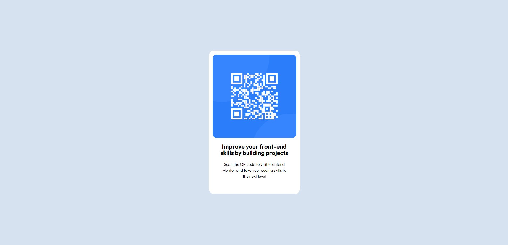

# Frontend Mentor - QR code component solution

This is a solution to the [QR code component challenge on Frontend Mentor](https://www.frontendmentor.io/challenges/qr-code-component-iux_sIO_H). Frontend Mentor challenges help you improve your coding skills by building realistic projects. 

## Table of contents

- [Overview](#overview)
  - [Screenshot](#screenshot)
  - [Links](#links)
- [My process](#my-process)
  - [Built with](#built-with)
  - [What I learned](#what-i-learned)
- [Author](#author)
- [Acknowledgments](#acknowledgments)


## Overview
 

### Screenshots
 

**Deskto & Mobile**



### Links

- Solution URL: [https://github.com/esocias/qr-challenge]

## My process

### Built with

- Semantic HTML5 markup
- CSS custom properties
- CSS Grid

### What I learned

In this challenge, I basically learned the use of grid to center the different components of the challenge, as well as the use of global CSS variables for subsequent aesthetic modifications.


```css
:root {
    --bckg:  hsl(212, 45%, 89%);
    --bckg-container: hsl(0, 0%, 100%);
    --att-a: hsl(228, 45%, 44%);
}
.main-cont {
    display: grid;
    place-items: center;
  }

  .container {
    display: grid;
    grid-template-rows: auto 1fr auto;
    place-items: center;
    width: 350px;
    background: var(--bckg-container);
    border-radius: 5%;
  }
```

## Author

- Website - [Eduardo Socias](https://www.your-site.com)
- Frontend Mentor - [@esocias](https://www.frontendmentor.io/profile/yourusername)
- Twitter - [@esociasgmail](https://www.twitter.com/yourusername)


## Acknowledgments

I have just finished four courses on web development and JavaScript at Platzi. These are my first steps.
